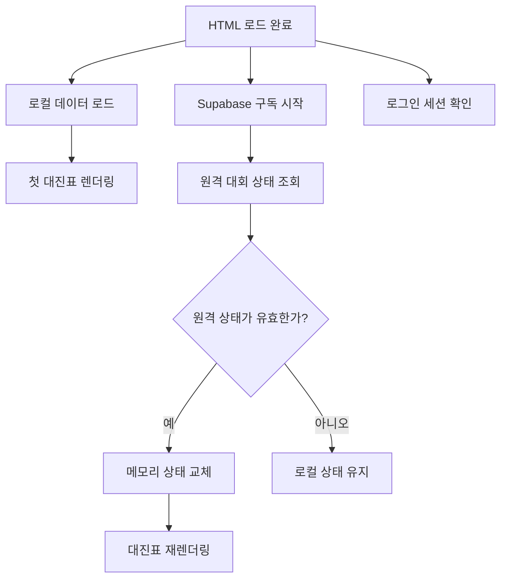

# 00. 전체 구조와 실행 순서

## 학습 목표

- 이 프로젝트를 데이터, 렌더링, 이벤트, 저장 계층으로 나눠 설명할 수 있다.
- 페이지를 열었을 때 실행되는 순서를 이해한다.
- 정적 HTML과 상태 기반 애플리케이션의 차이를 이해한다.

## 1. 핵심 관점

이 앱은 다음 관계로 이해하면 쉽다.

```text
상태(State) + 렌더링 규칙(Render) = 현재 화면(View)
```

- 상태: 팀, 경기, 점수, 승자, 공지, 로그인 여부
- 렌더링 규칙: `renderBracket()`, `createMatchDiv()`, CSS 클래스
- 화면: 브라우저에 생성된 실제 DOM

HTML에는 완성된 대진표가 없다. 빈 컨테이너와 고정 UI만 있고 JavaScript가 대진표를 만든다.

```html
<div class="bracket-container" id="bracket-container"></div>
```

## 2. 실행 흐름

`bracket.js`의 첫 부분은 DOM이 준비된 뒤 초기화를 시작한다.

```javascript
document.addEventListener('DOMContentLoaded', () => {
    fetchData();
    initializeSupabaseTournamentState();
    initializeTheme();
    initializeNavState();
    initializeAdminAuth();
});
```

실제 흐름은 다음과 같다.



로컬 데이터를 먼저 그리는 이유는 네트워크 응답 전에도 빈 화면이 보이지 않게 하기 위해서다.

## 3. 네 개의 논리 계층

### 데이터 계층

```javascript
let bracketState = [];
let tournamentPlayers = [];
let currentDisplayState = createEmptyDisplayState();
```

화면의 기준이 되는 JavaScript 객체다.

### 렌더링 계층

```text
renderBracket()
├─ createMobileBracketBoard()
├─ createMatchDiv()
│  └─ createPlayerDiv()
└─ renderTeamSidebar()
```

상태를 읽어 DOM을 만든다.

### 이벤트 계층

```javascript
button.addEventListener('click', handler);
input.addEventListener('input', handler);
form.addEventListener('submit', handler);
```

사용자 행동을 상태 변경 함수로 연결한다.

### 저장 및 동기화 계층

```text
localStorage       빠른 로컬 캐시와 복구
Supabase Database  공유되는 원본 상태
Supabase Realtime  다른 브라우저로 변경 전달
Supabase Auth/RLS  수정 권한 통제
```

## 4. 상태가 바뀌는 예

사용자가 승자를 클릭했다고 가정한다.

```text
팀 클릭
→ selectWinner()
→ 현재 경기 winner 변경
→ advanceWinner()로 다음 라운드 슬롯 변경
→ saveToLocalStorage()
→ Supabase 저장 예약
→ renderBracket()
```

화면 요소를 직접 초록색으로 바꾸는 것이 아니라, 먼저 `winner` 데이터를 변경한 뒤 렌더링이 그 데이터를 보고 `winner` 클래스를 붙인다.

## 5. 전체 재렌더링 방식

이 프로젝트는 변경된 한 요소만 정교하게 수정하기보다 대진표 DOM을 비우고 다시 만든다.

```javascript
container.innerHTML = '';
// bracketState를 순회하며 새 DOM 생성
```

장점:

- 화면과 상태가 어긋날 가능성이 낮다.
- 구현을 이해하고 디버깅하기 쉽다.
- 현재 규모에서는 충분히 빠르다.

단점:

- 입력창이 열린 상태에서 렌더링되면 입력창이 닫힌다.
- 큰 데이터에서는 불필요한 DOM 작업이 많다.
- Realtime 이벤트가 잦으면 화면이 반복해서 다시 만들어진다.

## 확인 문제

1. HTML에 팀 카드 18개를 미리 작성하지 않은 이유는 무엇인가?
2. 화면 색상을 직접 바꾸지 않고 상태를 먼저 바꾸는 이유는 무엇인가?
3. localStorage와 Supabase는 각각 어떤 역할을 맡는가?
4. 전체 재렌더링의 가장 큰 장점과 단점은 무엇인가?

## 작은 실습

다음 상태를 읽어 Console에 팀 이름을 출력하는 함수를 작성한다.

```javascript
const state = [
    [{ p1: { name: '1팀' }, p2: { name: '2팀' } }],
    [{ p1: null, p2: null }]
];
```

목표 출력:

```text
0라운드 0경기: 1팀 vs 2팀
1라운드 0경기: 대기중 vs 대기중
```

